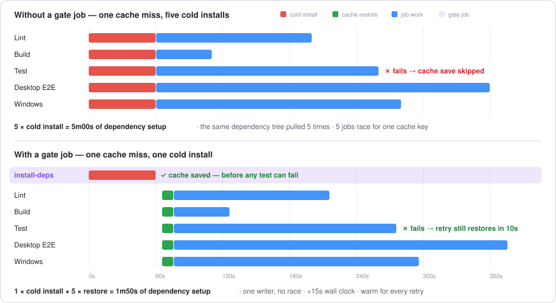
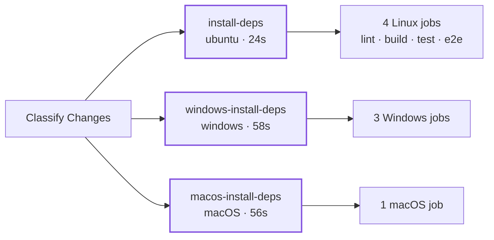

# configure-nodejs

**One step to install Node.js, detect your package manager, and get dependencies in place — plus the cache topology that stops a single cache miss from being billed once per job.**

[](https://github.com/pwrdrvr/configure-nodejs/actions/workflows/ci.yml)
[](LICENSE)
[](#reference)

```yaml
- uses: actions/checkout@v6
- uses: pwrdrvr/configure-nodejs@v1
  with:
    node-version: 22.x
```

Detects npm, pnpm, or Yarn, enables Corepack when the pinned version needs it, restores the right cache for the right package manager, and installs only when installing is actually required. Runs natively on Linux, macOS, and Windows.

That is the whole contract. The rest of this page is the reason it exists.

---

## The problem

Every job in your workflow does this, independently:

```yaml
- uses: actions/setup-node@v6
  with: { node-version: 22.x, cache: pnpm }
- run: pnpm install --frozen-lockfile
```

On a warm cache that is fine. It falls apart the moment the cache **key** changes — which is exactly what every dependency PR and every Dependabot bump does. All your jobs start together, all check the same key at the same instant, all miss because nobody has written it yet, and all download the same tree from the registry to produce byte-identical results.



<sub>Illustrative bar widths — 60s cold install, 10s restore. Measured numbers are in <a href="#receipts">Receipts</a>.</sub>

The wall clock barely moves — the gated version finishes a few seconds *later*, because the fan-out waits on the gate. That is the trade, and it is a good one: five cold installs become one.

### Why a cold key is the common case, not the rare one

| Situation | Cache state |
| --- | --- |
| PR touches the lockfile | **Miss.** New key, and no other branch has ever built it |
| First PR run on a new branch, lockfile untouched | Hit — PRs can read the base branch and default branch caches |
| Push to `main` after merging a lockfile PR | **Miss.** `main` cannot read caches created on a PR ref |
| Re-run of a failed job | Depends on whether some job in the previous attempt *succeeded* |

A run can restore caches from its own branch, its base branch, and the default branch — but never *sideways* from another PR. So one lockfile change buys you a cold build on the PR and a second cold build on `main` after the merge.

### The retry trap

This is the expensive one, and it is invisible from the workflow file. `actions/cache` and `actions/setup-node` both save in a **post step** declared `post-if: success()` — so a job that fails **never populates the cache**.

| Action | Save mechanism | Runs when the job fails? |
| --- | --- | --- |
| [`actions/cache`](https://github.com/actions/cache/blob/main/action.yml) | post step, `post-if: success()` | **No** |
| [`actions/setup-node`](https://github.com/actions/setup-node/blob/main/action.yml) with `cache:` | post step, `post-if: success()` | **No** |
| `pwrdrvr/configure-nodejs` | `actions/cache/save` inline, right after install | **Yes** |


You hit "Re-run failed jobs." It misses again, installs from scratch again, and again. The cache finally lands on the attempt that goes green — the one run that did not need it.

**With a post-step save, the cache is written only by jobs that succeed, so it is never written by the job you are actually debugging.**

### Two more ways the naive setup leaks

<details>
<summary><b>Failure mode: N writers race for one cache key</b> — the losers upload hundreds of megabytes and log a warning nobody reads.</summary>

Those jobs also finish installing at roughly the same moment, and all of them try to write the same cache entry. One wins. The rest upload their copy and then log this:

```
Unable to reserve cache with key pnpm-store-…-895783801555cc52, another job may be creating this cache.
```

It is a warning, not a failure, so nobody notices. You pay for the redundant uploads on every cold key, forever.

</details>

<details>
<summary><b>Failure mode: pnpm's <code>node_modules</code> does not survive a tarball round trip</b> — which is why this action caches the store instead.</summary>

The default instinct is to cache `node_modules`. For pnpm that is a trap of a different kind: pnpm's `node_modules` is a farm of symlinks into a content-addressed store, and archiving and re-extracting it produces a tree that is subtly, intermittently broken.

`configure-nodejs` caches the **store** for pnpm and re-runs `pnpm install --frozen-lockfile` against it. The install is cheap because nothing has to be downloaded, and the resulting link farm is real rather than reconstructed. For npm and Yarn it caches `node_modules` directly and skips install entirely on a hit.

</details>

---

## The fix: a gate job that only primes the cache

Put one job in front of the fan-out whose entire purpose is to answer *"does this key exist, and if not, make it exist."*

```yaml
jobs:
  install-deps:
    runs-on: ubuntu-latest
    steps:
      - uses: actions/checkout@v6
      - uses: pwrdrvr/configure-nodejs@v1
        with:
          node-version: 24.x
          lookup-only: "true"     # ← the whole trick

  lint:
    needs: install-deps           # ← nothing starts until the cache is warm
    runs-on: ubuntu-latest
    steps:
      - uses: actions/checkout@v6
      - uses: pwrdrvr/configure-nodejs@v1
        with:
          node-version: 24.x      # ← must match the gate exactly
      - run: pnpm lint

  build:
    needs: install-deps
    # ...same shape
```

`lookup-only: "true"` is what makes the gate almost free. It does not mean "check the cache and carry on" — it changes what the whole job does:

| | Cache **hit** | Cache **miss** |
| --- | --- | --- |
| `actions/setup-node` | **skipped** | runs |
| Corepack activation | **skipped** | runs |
| `install` | **skipped** | runs |
| Cache save | not needed | **saves, inline** |
| Typical cost | **~1 second** | one full install |

On a hit the gate does not even install Node.js. It answers a question and exits. On a miss it pays the install once, writes the cache immediately — not in a post step, not conditionally — and every downstream job restores. Because the gate contains no build, lint, or tests, it has almost no failure surface, which is exactly what you want in the job responsible for writing your cache.

> [!IMPORTANT]
> **The gate and its consumers must agree on every input that feeds the cache key**: `node-version`, `working-directory`, `package-manager`, `cache-electron`, `cache-key-suffix`, and the runner OS and architecture. Mismatch it and the gate warms a key nobody reads: no error, no warning, just the naive behavior plus an extra job.
>
> `node-version` contributes only its **major**, so a gate on `24.x` and a consumer on `24.14.1` do share a key — but a gate on `24.x` and a consumer on `22.x` do not, and neither matches one on `lts/*` in a year when `lts/*` is not 24.



<sub>One gate per <i>cache key</i>, not one per repository — the key includes runner OS and architecture, so each platform needs its own single writer.</sub>

<details>
<summary><b>Why the inline save and the gate job are two different fixes</b> — they solve the retry trap and the fan-out respectively, and neither substitutes for the other.</summary>

| | Fixes | Does not fix |
| --- | --- | --- |
| **Inline save** (built into the action) | The retry trap. The cache is written the moment the install finishes, so a later step failing in the same job cannot lose it | The fan-out. N jobs still miss together and still race to write |
| **Gate job** (`lookup-only` + `needs:`) | The fan-out. One job misses, one job installs, one job writes | Nothing on its own — a gate job using `actions/cache` still loses its cache if the gate itself fails |

Use them together and the cache is written exactly once, immediately, by a job that has nothing in it capable of failing.

</details>

<details>
<summary><b>When the gate job is not worth it</b> — single-job workflows, tiny dependency trees, and the single-point-of-failure trade it introduces.</summary>

- **A single-job workflow.** There is nothing to fan out to; the gate is pure overhead.
- **Two short jobs on a repo with ten dependencies.** The gate adds 7–20s of wall clock depending on platform (measured below), which is not worth it at that size.
- **It introduces a single point of failure.** `needs: install-deps` means a transient gate failure — a checkout blip, a lost runner — skips the *entire* fan-out. Without the gate that blip costs you one job. The gate's own steps are near-bulletproof, but checkout and runner allocation are not.

The gate pays for itself once you have three or more jobs sharing a key, or any job slow enough that you re-run it by hand.

</details>

---

## Receipts

Measured on [pwrdrvr/PwrAgent](https://github.com/pwrdrvr/PwrAgent), a pnpm monorepo with 888 packages and a ~231 MB store, running this pattern across three platforms ([workflow](https://github.com/pwrdrvr/PwrAgent/blob/main/.github/workflows/ci.yml)).

Across the 40 most recent CI runs:

| Metric | ubuntu gate | windows gate |
| --- | --- | --- |
| Runs that hit the cache | 38 / 39 | 38 / 39 |
| Gate step time on a hit | 0–1s | 1–6s |
| Gate step time on the miss | 17s | 46s |

The gate is a rounding error ~97% of the time, and on the rare run where it is not, it is the only job that pays.

<details>
<summary><b>Full per-job breakdown of a cold run</b> — all three platform keys cold, three cold installs instead of eight.</summary>

[Run 31262478890](https://github.com/pwrdrvr/PwrAgent/actions/runs/31262478890) was a PR that changed `pnpm-lock.yaml`, so all three keys were cold. Durations are the `configure-nodejs` step alone:

| Job | Role | Cache | Step time |
| --- | --- | --- | --- |
| `Install Dependencies` | gate (ubuntu) | **miss** → install + save | **17s** |
| `Lint` | consumer | hit | 9s |
| `Build` | consumer | hit | 14s |
| `Test` | consumer | hit | 11s |
| `Desktop E2E` | consumer | hit | 8s |
| `Setup Windows Dependencies` | gate (windows) | **miss** → install + save | **46s** |
| `Windows verify` | consumer | hit | 44s |
| `Windows desktop-main` | consumer | hit | 39s |
| `Windows renderer + packages` | consumer | hit | 40s |
| `Setup macOS Dependencies` | gate (self-hosted macOS) | **miss** → install + save | **43s** |
| `macOS Desktop E2E` | consumer | hit | 23s |

By the time `Test` ran the cache was already written. If `Test` had failed, the retry would have restored in 11 seconds instead of reinstalling from the registry.

</details>

---

## Reference

### Inputs

| Input | Default | Description |
| --- | --- | --- |
| `node-version` | `22.x` | Node.js version to install with `actions/setup-node`. Only its **major** reaches the cache key. A spec that can cross a major (`lts/*`, `latest`, `>=20`) must be resolved by `actions/setup-node` first, so those specs install Node.js even when `lookup-only` hits |
| `package-manager` | `""` | Optional override for `npm`, `pnpm`, or `yarn`; by default the action follows the package manager inferred from `package.json` and the lockfile present |
| `working-directory` | `"."` | Repository-relative directory containing `package.json` and the lockfile |
| `cache-key-suffix` | `""` | Optional suffix appended to the dependency cache key when you want to namespace cache entries |
| `cache-electron` | `"false"` | When `true`, caches the workspace-local Electron runtime download cache and native-addon prebuild download cache, and points lifecycle scripts at them. See [Electron lifecycle download caches](#electron-lifecycle-download-caches) |
| `lookup-only` | `"false"` | When `true`, only checks whether the cache exists and skips downloading it; on a cache hit the action also skips `setup-node` and install-time package-manager setup. See [the gate job pattern](#the-fix-a-gate-job-that-only-primes-the-cache) |

### Caching behavior

The cache key is built from the Node.js **major**, runner OS and architecture, normalized working directory, resolved package manager and version, the lockfile SHA, the enabled Electron cache schema, and `cache-key-suffix`.

The major is what matters because `NODE_MODULE_VERSION` — the ABI every compiled native addon in `node_modules` is built against — changes with each Node.js major and is stable within one. For npm and Yarn the action skips installation entirely on a hit, so a tree built under one major must never be restored under another. A pinned `node-version` supplies the major from the string alone and keeps the restore-before-`setup-node` fast path; a spec that can cross a major has to be resolved by `actions/setup-node` first, which is why those specs install Node.js even on a `lookup-only` hit.

| Package manager | Cached path | On a cache hit |
| --- | --- | --- |
| npm | `node_modules` | install skipped entirely |
| Yarn | `node_modules` | install skipped entirely |
| pnpm | workspace-local `.pnpm-store` | `pnpm install --frozen-lockfile --store-dir .pnpm-store` re-runs against the warm store |

For pnpm, `cache-hit` means *the store cache was found*. It does not mean `node_modules` was restored. Cache paths and keys are scoped to `working-directory`, so subdirectory apps in a monorepo stay isolated. The action exports `npm_config_store_dir` for later workflow steps so follow-up pnpm commands use the same store.

### Electron lifecycle download caches

Electron applications often download more than package tarballs during install. `@electron/get` downloads the Electron runtime, while native modules using `prebuild-install` download binaries compiled for Electron's ABI. A warm pnpm store does not contain either download, so postinstall can still make a network request—and still fail—even when pnpm reports zero packages downloaded.

Set `cache-electron: "true"` to include both download roots in the same immutable dependency cache:

| Lifecycle consumer | Environment variable | Workspace-local root |
| --- | --- | --- |
| `@electron/get` | `electron_config_cache` | `<working-directory>/.cache/configure-nodejs/electron` |
| `prebuild-install` (including its `_prebuilds` directory) | `npm_config_cache` | `<working-directory>/.cache/configure-nodejs/npm` |

The action creates these directories and exports both variables before dependency installation, so package-manager lifecycle scripts write to the paths that will be saved. It validates real paths before restore and again before save; a working-directory or cache-path symlink that escapes the checked-out workspace fails instead of archiving unrelated self-hosted-runner files.

This is opt-in because it expands each dependency cache and changes install environment for Electron projects. Enabling it adds the explicit schema segment `electron-true-v1` to the cache key. Leaving it disabled keeps the previous cache paths and key exactly, while changing the schema in a future action version will force a cold cache rather than restore an entry with incomplete artifacts.

A PwrAgent-like gate and consumer must both opt in:

```yaml
jobs:
  install-deps:
    runs-on: ubuntu-latest
    steps:
      - uses: actions/checkout@v6
      - uses: pwrdrvr/configure-nodejs@v1
        with:
          node-version: 24.x
          cache-electron: "true"
          lookup-only: "true"

  test:
    needs: install-deps
    runs-on: ubuntu-latest
    steps:
      - uses: actions/checkout@v6
      - uses: pwrdrvr/configure-nodejs@v1
        with:
          node-version: 24.x
          cache-electron: "true"
      - run: pnpm test
```

On the first opt-in miss, the `lookup-only` gate still sets up Node.js, installs dependencies, populates both lifecycle caches, and saves them with the package-manager cache. On a hit, the gate only performs the lookup. Its downstream jobs restore all three cache components before postinstall runs. Repeat the opt-in on every OS/architecture-specific gate and consumer that should share this behavior.

<details>
<summary><b>All 19 outputs</b> — <code>package-manager</code>, <code>lockfile-sha</code>, <code>cache-hit</code>, <code>node-major</code>, <code>pnpm-store-path</code>, <code>install-command</code>, and per-phase timings in milliseconds.</summary>

| Output | Description |
| --- | --- |
| `package-manager` | Resolved package manager |
| `package-manager-version` | Version from `package.json#packageManager` when available |
| `manager-cache-key` | Manager-specific cache-key segment |
| `lockfile-name` | Detected lockfile name |
| `lockfile-path` | Lockfile path relative to the working directory |
| `lockfile-sha` | SHA256 hash of the lockfile |
| `install-command` | Install command used when dependency installation runs |
| `working-directory` | Normalized working directory |
| `working-directory-key` | Cache-key-safe working-directory identifier |
| `cache-hit` | `true` when the dependency cache entry exists for the computed key |
| `node-major` | Node.js major version the dependency cache key was built from |
| `pnpm-store-path` | Absolute workspace-local pnpm store path when pnpm setup runs |
| `cache-restore-duration-ms` | Measured cache restore phase duration |
| `setup-node-duration-ms` | Measured `actions/setup-node` phase duration |
| `package-manager-activation-duration-ms` | Measured Corepack/package-manager activation duration |
| `store-discovery-duration-ms` | Measured pnpm store discovery duration |
| `install-duration-ms` | Measured dependency installation duration |
| `cache-save-duration-ms` | Measured cache save phase duration |
| `total-duration-ms` | Measured total action duration |

Every phase is timed and reported in both the outputs and the job summary, so you can see exactly where a slow setup went.

</details>

<details>
<summary><b>More usage: subdirectory projects, pinned pnpm on Windows, and branching on the cache probe</b></summary>

**Subdirectory project**

```yaml
- uses: actions/checkout@v6
- uses: pwrdrvr/configure-nodejs@v1
  with:
    node-version: 22.x
    working-directory: apps/web
```

**Windows with a pinned pnpm version**

Keep pnpm pinned in `package.json#packageManager`; the action activates that exact version with Corepack and verifies the workspace-local store before installing.

```yaml
jobs:
  windows:
    runs-on: windows-latest
    steps:
      - uses: actions/checkout@v6
      - uses: pwrdrvr/configure-nodejs@<immutable-commit-sha>
        with:
          node-version: 24.14.1
          working-directory: .
```

**Branching on the cache probe**

```yaml
- id: configure-nodejs
  uses: pwrdrvr/configure-nodejs@v1
  with:
    lookup-only: "true"

- if: steps.configure-nodejs.outputs.cache-hit == 'true'
  run: echo "Dependency cache is available"
```

</details>

<details>
<summary><b>Package-manager detection, Yarn support boundary, and command-execution safety</b></summary>

**Detection order**

1. explicit `package-manager` input
2. `package.json#packageManager`
3. supported lockfiles in the working directory

The action fails fast when it finds multiple supported lockfiles in the same working directory.

**Yarn boundary**

`v1` targets Yarn repositories that install into `node_modules`. Yarn 2+ uses `yarn install --immutable`; Yarn 1 uses `yarn install --frozen-lockfile`. Plug'n'Play-specific caching is intentionally out of scope for `v1`.

**Command execution**

Package-manager and install commands are executed as structured argument arrays through the GitHub Actions runtime. This avoids POSIX shell assumptions on Windows and avoids interpolating repository metadata into a shell command. For pinned pnpm and Yarn projects, Corepack prepares the declared version and the action verifies the activated version before installation. Third-party package integrity remains enforced by the committed lockfile and the package manager's frozen/immutable install mode.

</details>

<details>
<summary><b>Development and releases</b> — how CI validates the action, and how to cut a version.</summary>

CI runs helper unit tests and npm, pnpm, and Yarn fixture installs on GitHub-hosted Linux, macOS, and Windows runners. Each fixture primes a new cache, removes materialized dependencies, restores that cache, and validates the installed package. Additional dogfood coverage lives in [`pwrdrvr/configure-nodejs-test`](https://github.com/pwrdrvr/configure-nodejs-test), which can validate a configurable published ref.

Tag a semantic version such as `v1.0.0` to trigger the release workflow. It creates or updates the floating major tag like `v1` and publishes a GitHub release with generated notes.

</details>

## License

[MIT](LICENSE)
