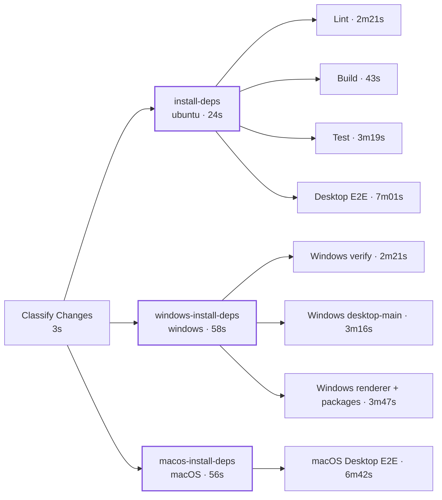

# configure-nodejs

**One step to install Node.js, detect your package manager, and get dependencies in place — plus the cache topology that stops a single cache miss from being billed once per job.**

[](https://github.com/pwrdrvr/configure-nodejs/actions/workflows/ci.yml)
[](LICENSE)
[](#platform-support)

```yaml
- uses: actions/checkout@v6
- uses: pwrdrvr/configure-nodejs@v1
  with:
    node-version: 22.x
```

That is the whole contract. It detects npm, pnpm, or Yarn, enables Corepack when the pinned version needs it, restores the right cache for the right package manager, and installs only when installing is actually required.

But the reason this action exists is the next 200 lines.

---

## The part nobody gets right

Here is the workflow everyone writes:

```yaml
jobs:
  lint:
    steps:
      - uses: actions/checkout@v6
      - uses: actions/setup-node@v6
        with:
          node-version: 22.x
          cache: pnpm
      - run: pnpm install --frozen-lockfile
      - run: pnpm lint

  build:   # ...the same five lines
  test:    # ...the same five lines
  e2e:     # ...the same five lines
  windows: # ...the same five lines
```

It is not wrong, exactly. On a warm cache it is fine. It falls apart the moment the cache **key** changes — which is precisely what every dependency PR, every `pnpm add`, and every Dependabot bump does.

And a cold key is not the rare case. It is the case you are always in when it matters most:

| Situation | Cache state |
| --- | --- |
| PR touches the lockfile | **Miss.** New key, and no other branch has ever built it |
| First PR run on a new branch, lockfile untouched | Hit — PRs can read the base branch and default branch caches |
| Push to `main` after merging a lockfile PR | **Miss.** `main` cannot read caches created on a PR ref |
| Re-run of a failed job | Depends entirely on whether some job in the previous attempt *succeeded* |

GitHub's rule is that a run can restore caches from its own branch, its base branch, and the default branch — but never *sideways* from another PR. So a single lockfile change costs you one cold build on the PR, and then a second cold build on `main` after the merge. Both of those are runs where every job in the fan-out misses simultaneously.

### Failure mode 1 — every job pays for the same miss

All your jobs start at the same moment. All of them check the same key at the same moment. All of them miss, because nobody has written it yet. So all of them download the entire dependency tree from the registry, in parallel, to produce byte-identical results.


<sub>Illustrative bar widths — 60s cold install, 10s restore. Real numbers from a production repo are in <a href="#receipts">Receipts</a>.</sub>

The wall clock barely moves — the gated version actually finishes a few seconds *later*, because the fan-out waits on the gate. That is the trade, and it is a good one: five cold installs became one, and you stopped pulling five identical copies of the dependency tree out of the registry.

### Failure mode 2 — five writers, one key

Those five jobs also finish installing at roughly the same moment, and all five try to write the same cache entry. One wins. The rest upload a few hundred megabytes and then log this:

```
Unable to reserve cache with key pnpm-store-…-895783801555cc52, another job may be creating this cache.
```

It is a warning, not a failure, so nobody ever notices. You are simply paying for four redundant uploads on every cold key, forever.

### Failure mode 3 — the retry trap

This is the expensive one, and it is entirely invisible from the workflow file.

`actions/cache` and `actions/setup-node` both save the cache in a **post step**, and both declare it like this:

```yaml
runs:
  main: 'dist/restore/index.js'
  post: 'dist/save/index.js'
  post-if: success()      # ← this line
```

| Action | Save mechanism | Runs when the job fails? |
| --- | --- | --- |
| [`actions/cache`](https://github.com/actions/cache/blob/main/action.yml) | post step, `post-if: success()` | **No** |
| [`actions/setup-node`](https://github.com/actions/setup-node/blob/main/action.yml) with `cache:` | post step, `post-if: success()` | **No** |
| `pwrdrvr/configure-nodejs` | `actions/cache/save` inline, right after install | **Yes** |

So: a job that fails **never populates the cache**. Now put that together with a lockfile PR, where the key is cold and one of your jobs is flaky, or red for a real reason you are iterating on.


You hit "Re-run failed jobs." It misses again, because the previous attempt never wrote anything. It installs from scratch again. And again. The cache finally lands on the attempt that goes green — the one run that did not need it.

**With a post-step save, the cache is written only by jobs that succeed — so it is never written by the job you are actually debugging.**

### Failure mode 4 — pnpm's `node_modules` does not survive the round trip

The default instinct is to cache `node_modules`. For pnpm that is a trap of a different kind: pnpm's `node_modules` is a farm of symlinks into a content-addressed store, and archiving and re-extracting it produces a tree that is subtly, intermittently broken.

`configure-nodejs` caches the **store** for pnpm and re-runs `pnpm install --frozen-lockfile` against it. The install is cheap because nothing has to be downloaded, and the resulting link farm is real rather than reconstructed. For npm and Yarn it caches `node_modules` directly and skips install entirely on a hit.

---

## The fix: a gate job that does nothing but prime the cache

Add one job in front of the fan-out whose entire purpose is to answer *"does this key exist, and if not, make it exist."*

```yaml
jobs:
  install-deps:
    name: Install Dependencies
    runs-on: ubuntu-latest
    steps:
      - uses: actions/checkout@v6
      - uses: pwrdrvr/configure-nodejs@v1
        with:
          node-version: 24.x
          lookup-only: "true"     # ← the whole trick

  lint:
    needs: install-deps           # ← nothing starts until the cache is warm
    runs-on: ubuntu-latest
    steps:
      - uses: actions/checkout@v6
      - uses: pwrdrvr/configure-nodejs@v1
        with:
          node-version: 24.x
      - run: pnpm lint

  build:
    needs: install-deps
    # ...same shape
  test:
    needs: install-deps
    # ...same shape
```

`lookup-only: "true"` is what makes the gate almost free. It is not "check the cache and carry on" — it changes what the whole job does:

| | Cache **hit** | Cache **miss** |
| --- | --- | --- |
| Cache probe | key lookup only, no download | key lookup only, no download |
| `actions/setup-node` | **skipped** | runs |
| Corepack activation | **skipped** | runs |
| `install` | **skipped** | runs |
| Cache save | not needed | **saves, inline** |
| Typical cost | **~1 second** | one full install |

On a hit the gate job does not even install Node.js. It answers a question and exits. On a miss it pays the install exactly once, writes the cache immediately — not in a post step, not conditionally — and every downstream job restores.

And because the gate job contains no build, no lint, and no tests, it has essentially no failure surface. It is the one job in your workflow that reliably succeeds, which is exactly the property you want in the job responsible for writing your cache.

### Two halves, two different problems

These are separable, and it is worth being clear about which does what:

| | Fixes | Does not fix |
| --- | --- | --- |
| **Inline save** (built into the action) | The retry trap. The cache is written the moment the install finishes, so a later step failing in the same job cannot lose it | The fan-out. N jobs still miss together and still race to write |
| **Gate job** (`lookup-only` + `needs:`) | The fan-out. One job misses, one job installs, one job writes | Nothing on its own — a gate job using `actions/cache` still loses its cache if the gate itself fails |

Use them together and the cache is written exactly once, immediately, by a job that has nothing in it capable of failing.

### The resulting job graph

Real shape from the run below — one gate per platform, each feeding its own fan-out:



<sub>Purple-outlined jobs are the gate jobs. They are the only jobs that ever write a cache.</sub>

One gate per *cache key*, not one per repository. A cache key includes the runner OS and architecture, so Linux, Windows, and self-hosted macOS each need their own gate — they are separate caches and each needs its own single writer.

### When you should not bother

- **A single-job workflow.** There is nothing to fan out to; the gate is pure overhead.
- **Two short jobs on a repo with ten dependencies.** The ~10s the gate adds to the critical path is not worth it.

The gate pays for itself once you have three or more jobs sharing a key, or any job slow enough that you re-run it by hand.

---

## Receipts

Real numbers from [pwrdrvr/PwrAgent](https://github.com/pwrdrvr/PwrAgent), a pnpm monorepo with 888 packages and a ~231 MB store, using this pattern across three platforms.

**[Run 31262478890](https://github.com/pwrdrvr/PwrAgent/actions/runs/31262478890)** — a PR that changed `pnpm-lock.yaml`, so all three keys were cold. Durations are the `configure-nodejs` step alone:

| Job | Role | Cache | Step time |
| --- | --- | --- | --- |
| `Install Dependencies` | gate (ubuntu) | **miss** → install + save | **17s** |
| `Lint` | consumer | hit | 9s |
| `Build` | consumer | hit | 14s |
| `Test` | consumer | hit | 11s |
| `Desktop E2E` | consumer | hit | 8s |
| `Setup Windows Dependencies` | gate (windows) | **miss** → install + save | **46s** |
| `Windows verify` | consumer | hit | 44s |
| `Windows desktop-main` | consumer | hit | 39s |
| `Windows renderer + packages` | consumer | hit | 40s |
| `Setup macOS Dependencies` | gate (self-hosted macOS) | **miss** → install + save | **43s** |
| `macOS Desktop E2E` | consumer | hit | 23s |

Three cold installs instead of eight — and, more importantly, by the time `Test` ran the cache was already written. If `Test` had failed, the retry would have restored in 11 seconds instead of reinstalling from the registry.

**Steady state**, sampling the 40 most recent CI runs on that repo:

| Metric | ubuntu gate | windows gate |
| --- | --- | --- |
| Runs that hit the cache | 38 / 39 | 38 / 39 |
| Gate step time on a hit | 0–1s | 1–6s |
| Gate step time on the miss | 17s | 46s |

That is the shape you want: the gate is a rounding error ~97% of the time, and on the rare run where it is not, it is the only job that pays.

The [full workflow is public](https://github.com/pwrdrvr/PwrAgent/blob/main/.github/workflows/ci.yml) if you want to read the real thing rather than the trimmed version above.

---

## Reference

### Usage

**Root project**

```yaml
steps:
  - uses: actions/checkout@v6
  - uses: pwrdrvr/configure-nodejs@v1
    with:
      node-version: 22.x
```

**Subdirectory project**

```yaml
steps:
  - uses: actions/checkout@v6
  - uses: pwrdrvr/configure-nodejs@v1
    with:
      node-version: 22.x
      working-directory: apps/web
```

Cache paths and cache keys are scoped to `working-directory`, so subdirectory apps in a monorepo stay isolated from each other.

**Windows with a pinned pnpm version**

The same contract works on GitHub-hosted Windows runners. Keep pnpm pinned in `package.json#packageManager`; the action activates that exact version with Corepack and verifies the workspace-local store before installing.

```yaml
jobs:
  windows:
    runs-on: windows-latest
    steps:
      - uses: actions/checkout@v6
      - uses: pwrdrvr/configure-nodejs@<immutable-commit-sha>
        with:
          node-version: 24.14.1
          working-directory: .
```

**Branching on the cache probe**

```yaml
steps:
  - uses: actions/checkout@v6
  - id: configure-nodejs
    uses: pwrdrvr/configure-nodejs@v1
    with:
      lookup-only: "true"

  - if: steps.configure-nodejs.outputs.cache-hit == 'true'
    run: echo "Dependency cache is available"
```

### Inputs

| Input | Default | Description |
| --- | --- | --- |
| `node-version` | `22.x` | Node.js version to install with `actions/setup-node` |
| `package-manager` | `""` | Optional override for `npm`, `pnpm`, or `yarn`; by default the action follows the package manager inferred from `package.json` and the lockfile present |
| `working-directory` | `"."` | Repository-relative directory containing `package.json` and the lockfile |
| `cache-key-suffix` | `""` | Optional suffix appended to the dependency cache key when you want to namespace cache entries |
| `lookup-only` | `"false"` | When `true`, only checks whether the cache exists and skips downloading it; on a cache hit the action also skips `setup-node` and install-time package-manager setup. See [the gate job pattern](#the-fix-a-gate-job-that-does-nothing-but-prime-the-cache) |

### Outputs

| Output | Description |
| --- | --- |
| `package-manager` | Resolved package manager |
| `package-manager-version` | Version from `package.json#packageManager` when available |
| `manager-cache-key` | Manager-specific cache-key segment |
| `lockfile-name` | Detected lockfile name |
| `lockfile-path` | Lockfile path relative to the working directory |
| `lockfile-sha` | SHA256 hash of the lockfile |
| `install-command` | Install command used when dependency installation runs |
| `working-directory` | Normalized working directory |
| `working-directory-key` | Cache-key-safe working-directory identifier |
| `cache-hit` | `true` when the dependency cache entry exists for the computed key |
| `pnpm-store-path` | Absolute workspace-local pnpm store path when pnpm setup runs |
| `cache-restore-duration-ms` | Measured cache restore phase duration in milliseconds |
| `setup-node-duration-ms` | Measured `actions/setup-node` phase duration in milliseconds |
| `package-manager-activation-duration-ms` | Measured Corepack/package-manager activation duration in milliseconds |
| `store-discovery-duration-ms` | Measured pnpm store discovery duration in milliseconds |
| `install-duration-ms` | Measured dependency installation duration in milliseconds |
| `cache-save-duration-ms` | Measured cache save phase duration in milliseconds |
| `total-duration-ms` | Measured total action duration in milliseconds |

Every phase is timed and reported in both the outputs and the job summary, so you can see exactly where a slow setup went.

### Package-manager detection

Resolution order:

1. explicit `package-manager` input
2. `package.json#packageManager`
3. supported lockfiles in the working directory

The action fails fast when it finds multiple supported lockfiles in the same working directory.

### Caching behavior

The cache key includes:

- `node-version`
- runner OS and architecture
- normalized working directory
- resolved package manager and version
- lockfile SHA

What gets cached, and what happens on a hit:

| Package manager | Cached path | On a cache hit |
| --- | --- | --- |
| npm | `node_modules` | install skipped entirely |
| Yarn | `node_modules` | install skipped entirely |
| pnpm | workspace-local `.pnpm-store` | `pnpm install --frozen-lockfile --store-dir .pnpm-store` re-runs against the warm store |

For pnpm, `cache-hit` means *the store cache was found*. It does not mean `node_modules` was restored. In `lookup-only` mode a pnpm cache hit still skips Node.js setup and dependency installation, because the gate job never needed `node_modules` in the first place. The action also exports `npm_config_store_dir` for later workflow steps so follow-up pnpm commands use the same store.

Package-manager and install commands are executed as structured argument arrays through the GitHub Actions runtime. This avoids POSIX shell assumptions on Windows and avoids interpolating repository metadata into a shell command. For pinned pnpm and Yarn projects, Corepack prepares the declared version and the action verifies the activated version before installation. Third-party package integrity remains enforced by the committed lockfile and the package manager's frozen/immutable install mode.

### Platform support

Linux, macOS, and Windows, on GitHub-hosted and self-hosted runners. Windows is native — no bash shim, no Git Bash assumption.

### Yarn support boundary

The first release targets Yarn repositories that install into `node_modules`.

- Yarn 2+ uses `yarn install --immutable`
- Yarn 1 uses `yarn install --frozen-lockfile`
- the dogfood coverage in `pwrdrvr/configure-nodejs-test` uses Yarn 4 with `nodeLinker: node-modules`

Plug'n'Play-specific caching is intentionally out of scope for `v1`.

---

## Development

The repository CI runs helper unit tests and npm, pnpm, and Yarn fixture installs on GitHub-hosted Linux, macOS, and Windows runners. Each fixture primes a new cache, removes materialized dependencies, restores that cache, and validates the installed package.

Additional dogfood coverage lives in [`pwrdrvr/configure-nodejs-test`](https://github.com/pwrdrvr/configure-nodejs-test), which can validate a configurable published ref.

## Releases

Tag a semantic version such as `v1.0.0` to trigger the release workflow. The workflow creates or updates the floating major tag like `v1` and publishes a GitHub release with generated notes.

## License

[MIT](LICENSE)
