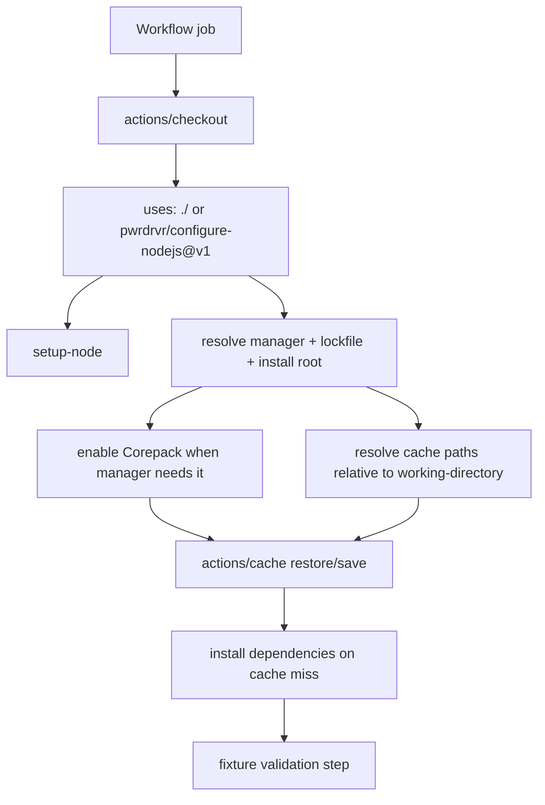

# feat: Publish shareable configure-nodejs GitHub Action

## Overview

Extract the existing `configure-nodejs` composite action from `microapps-core` into this standalone repository so it can be consumed as `pwrdrvr/configure-nodejs@v1`. The new repo should preserve the current install-and-cache workflow, add the minimum portability needed for same-repo multi-fixture testing, and ship with CI coverage that proves npm, pnpm, and Yarn installs each work in isolation.

## Problem Frame

The current action is useful, but it is coupled to `microapps-core` in ways that make it hard to publish directly:

- the composite action depends on a helper script outside the action directory
- it assumes the install root is `GITHUB_WORKSPACE`
- its cache paths are tuned for the monorepo layout
- there is no standalone repo contract, versioning story, or fixture-based CI proving it works across package managers

The goal is to create a small, trustworthy action repo that keeps the current ergonomics while making the action reusable by other repositories and straightforward to validate before tagging a shared `v1`.

## Requirements Trace

- R1. Preserve the current public behavior of installing Node.js, resolving the package manager, enabling Corepack when needed, restoring dependency cache, and installing dependencies on cache miss.
- R2. Publish the action from the repo root so callers can use `pwrdrvr/configure-nodejs@v1` without extra path suffixes.
- R3. Keep npm, pnpm, and Yarn support in one repository and verify each manager in CI with isolated fixtures.
- R4. Make fixture isolation a first-class part of the action design so tests do not rely on fragile subtree or sparse checkout tricks.
- R5. Add enough documentation, outputs, and release notes guidance that the repo is usable as a maintained shared action rather than just a code dump.

## Scope Boundaries

- Initial extraction only; this plan does not include migrating `microapps-core` to consume the published action yet.
- No separate Marketplace branding or marketing work beyond standard action metadata and README usage docs.
- No attempt to support every Yarn mode on day one. The first release should support Yarn installs in `node_modules` mode; full Yarn PnP-aware caching can follow later if it is worth the complexity.
- No subtree-checkout-heavy test harness unless the simpler `working-directory` design proves insufficient during implementation.

## Context & Research

### Relevant Code and Patterns

- Source behavior to preserve comes from the current in-repo composite action in `microapps-core` at `.github/actions/configure-nodejs/action.yml`.
- Package manager detection, lockfile hashing, and install command selection come from `microapps-core` `scripts/package-manager/resolve-manager.mjs`.
- Existing workflow usage in `microapps-core` shows the main contract is `node-version`, `package-manager`, and `lookup-only`, with a common pattern of using an install-only cache priming job before build/test jobs.

### Institutional Learnings

- No relevant `docs/solutions/` entries were present for this exact extraction.

### External References

- GitHub Docs: creating a composite action confirms same-repo local-action testing with `uses: ./` and the expectation that action assets live beside `action.yml`.
- GitHub Docs: matrix jobs support one workflow covering all package-manager fixtures without duplicating workflow logic.
- `actions/checkout` README documents `path` and `sparse-checkout`, which are available as escape hatches but not required for the primary fixture strategy.
- GitHub dependency caching reference confirms `cache-hit` as the important observable cache signal and reinforces treating cached paths as repository-readable data.

## Key Technical Decisions

- Publish the action from the repository root with `action.yml` at the top level.
  Rationale: this gives the cleanest consumer syntax, keeps the repo single-purpose, and avoids forcing callers to append a subpath.

- Vendor the helper logic into this repo and reference it through `github.action_path`.
  Rationale: a published action must be self-contained; relying on a sibling repo path would make the action non-portable.

- Add a `working-directory` input and treat it as the action's install root.
  Rationale: this is the simplest way to support isolated npm/pnpm/Yarn fixtures in one repo and also makes the published action more useful for monorepos and subdirectory apps.

- Keep same-repo fixtures in dedicated directories instead of using subtree checkouts as the default isolation mechanism.
  Rationale: isolated fixture directories are easier to understand, faster to iterate on, and directly validate the action's subdirectory behavior. `actions/checkout` path shaping remains available if implementation reveals a real need for it.

- Expose action outputs for the resolved manager, lockfile path, install command, working directory, and cache hit result.
  Rationale: outputs make CI assertions easier, improve debuggability for consumers, and let workflows branch on cache behavior without reaching into composite-internal step IDs.

- Make Yarn support version-aware and document the supported mode explicitly.
  Rationale: the current source logic already parses `packageManager` versions; using that information to select modern Yarn install semantics prevents the shared action from hard-coding a stale assumption. For v1, tests should target a Yarn fixture configured for `node_modules` installs so cache behavior matches the action's design.

## Open Questions

### Resolved During Planning

- How should same-repo isolation work for npm/pnpm/Yarn fixtures?
  Resolution: use one repo with fixture directories plus a `working-directory` input on the action, not subtree checkouts as the primary mechanism.

- Where should the published action live?
  Resolution: place `action.yml` at the repo root so the repository itself is the action.

- How should the first release handle Yarn complexity?
  Resolution: support and test Yarn in `node_modules` mode for v1, and defer PnP-aware cache semantics.

### Deferred to Implementation

- Whether the action should compute cache paths in a dedicated helper script or inline inside `action.yml`.
  Why deferred: both approaches are viable; the better choice depends on how much path normalization logic is needed once the working-directory changes are wired in.

- Whether `microapps-core` should adopt the published action immediately after this repo lands.
  Why deferred: that is a follow-on rollout decision, not required to ship the standalone action repo.

## High-Level Technical Design

> *This illustrates the intended approach and is directional guidance for review, not implementation specification. The implementing agent should treat it as context, not code to reproduce.*

## Implementation Units

- [x] **Unit 1: Scaffold the standalone action contract**

**Goal:** Create a self-contained root-level composite action that preserves the current behavior while decoupling it from `microapps-core`.

**Requirements:** R1, R2

**Dependencies:** None

**Files:**
- Create: `action.yml`
- Create: `scripts/resolve-manager.mjs`
- Create: `package.json`
- Create: `.gitignore`

**Approach:**
- Copy the current composite action behavior into `action.yml` at the repo root.
- Copy and adapt the manager-resolution helper so it no longer depends on a sibling repository path.
- Add `working-directory` as an input with a default of `.` and normalize it against `GITHUB_WORKSPACE`.
- Keep the existing inputs (`node-version`, `package-manager`, `lookup-only`) for compatibility with the source action's contract.
- Add formal outputs so workflows and fixture tests can assert what the action resolved.

**Patterns to follow:**
- `microapps-core` `.github/actions/configure-nodejs/action.yml`
- `microapps-core` `scripts/package-manager/resolve-manager.mjs`

**Test scenarios:**
- Happy path: explicit `package-manager: npm` resolves npm, finds `package-lock.json`, and emits `npm ci`.
- Happy path: `packageManager` field `pnpm@...` resolves pnpm without an explicit override and emits `pnpm install --frozen-lockfile`.
- Happy path: Yarn fixture with `packageManager: yarn@...` resolves Yarn and emits the documented Yarn install command for the supported mode.
- Edge case: `working-directory` pointing at a nested fixture resolves paths relative to that fixture instead of repository root.
- Error path: unsupported manager input fails with a clear error naming the supported managers.
- Error path: multiple lockfiles in one install root fail early and explain how to disambiguate.
- Error path: no supported lockfile and no explicit manager fail with an actionable message.

**Verification:**
- A workflow can call the root action and inspect stable outputs without relying on implementation-internal step IDs.

- [x] **Unit 2: Generalize cache and install-root handling for subdirectory consumers**

**Goal:** Make the action safe and predictable when the target project lives below repository root, which is required both for fixture testing and real monorepo use.

**Requirements:** R1, R3, R4

**Dependencies:** Unit 1

**Files:**
- Modify: `action.yml`
- Create: `scripts/resolve-cache-paths.mjs`
- Test: `test/resolve-cache-paths.test.mjs`
- Test: `test/resolve-manager.test.mjs`

**Approach:**
- Resolve cache paths relative to `working-directory` so fixtures do not collide and consumers can target a subdirectory app intentionally.
- Include the resolved working directory in the cache key so npm, pnpm, and Yarn fixtures cannot poison each other's caches.
- Preserve the current `lookup-only` behavior while surfacing the resulting `cache-hit` status as an action output.
- Keep the default cache strategy centered on `node_modules`-style installs, and document the corresponding Yarn support boundary.

**Technical design:** *(directional guidance, not implementation specification)*
- Compute an absolute install root from `GITHUB_WORKSPACE` plus `working-directory`.
- Emit cache paths as workspace-relative paths so `actions/cache` receives stable, explicit targets.
- Feed the resolved path metadata into both the cache key and the public outputs.

**Patterns to follow:**
- Existing cache-key composition pattern from `microapps-core` `action.yml`
- GitHub dependency caching pattern centered on `cache-hit` as the observable branch point

**Test scenarios:**
- Happy path: npm and pnpm fixtures produce distinct cache keys even when they share the same runner and node version.
- Happy path: repeated runs against one fixture restore only that fixture's dependency tree.
- Edge case: `working-directory: .` preserves root-project behavior and cache paths.
- Edge case: nested fixture with a package manager override still uses the nested lockfile and nested cache paths.
- Error path: invalid `working-directory` fails before attempting install or cache restore.
- Integration: fixture workflow can branch on the action's `cache-hit` output without reaching into composite internals.

**Verification:**
- Cache keys and outputs are stable enough that fixture jobs can prove isolation by manager and directory.

- [x] **Unit 3: Add isolated npm, pnpm, and Yarn fixtures plus CI matrix coverage**

**Goal:** Prove the action works end-to-end for the three supported package managers inside one repository without cross-fixture leakage.

**Requirements:** R3, R4

**Dependencies:** Unit 1, Unit 2

**Files:**
- Create: `fixtures/npm-basic/package.json`
- Create: `fixtures/npm-basic/package-lock.json`
- Create: `fixtures/npm-basic/check.mjs`
- Create: `fixtures/pnpm-basic/package.json`
- Create: `fixtures/pnpm-basic/pnpm-lock.yaml`
- Create: `fixtures/pnpm-basic/check.mjs`
- Create: `fixtures/yarn-basic/package.json`
- Create: `fixtures/yarn-basic/yarn.lock`
- Create: `fixtures/yarn-basic/.yarnrc.yml`
- Create: `fixtures/yarn-basic/check.mjs`
- Create: `.github/workflows/ci.yml`

**Approach:**
- Keep each fixture self-contained with its own lockfile, tiny dependency set, and one validation script that proves the install actually happened.
- Use a matrix workflow where each job checks out the repo, runs the local action with `working-directory` set to the fixture path, and then runs the fixture's validation script.
- Prefer direct same-repo testing with `uses: ./`; only introduce checkout path shaping if implementation exposes a real limitation.
- Include at least one assertion per fixture against the action outputs so CI verifies both install behavior and manager detection behavior.

**Execution note:** Start with a failing end-to-end fixture workflow for one manager, then expand the same pattern to the other two managers.

**Patterns to follow:**
- GitHub matrix-job pattern from the Actions docs
- Local-action invocation pattern described in GitHub's composite-action documentation

**Test scenarios:**
- Happy path: npm fixture installs dependencies and `check.mjs` succeeds after the action runs.
- Happy path: pnpm fixture installs dependencies and `check.mjs` succeeds after the action runs.
- Happy path: Yarn fixture installs dependencies in the documented supported mode and `check.mjs` succeeds after the action runs.
- Edge case: each fixture reports the expected resolved package manager through action outputs.
- Error path: a deliberately malformed test fixture or negative script-level test proves CI fails clearly when lockfile detection is broken.
- Integration: the matrix workflow validates `uses: ./` against the root action definition, not a copied path or test-only wrapper.

**Verification:**
- One CI workflow run shows green coverage for npm, pnpm, and Yarn using the exact repository structure that will ship to consumers.

- [x] **Unit 4: Document usage, support boundaries, and release/versioning**

**Goal:** Make the repository understandable and publishable as a maintained shared action.

**Requirements:** R2, R5

**Dependencies:** Unit 1, Unit 2, Unit 3

**Files:**
- Create: `README.md`
- Modify: `action.yml`
- Create: `.github/workflows/release.yml`

**Approach:**
- Document the action inputs, outputs, caching behavior, supported package-manager detection modes, and the `working-directory` contract.
- Include README examples for a root-level project and a subdirectory project.
- Document the first-release support boundary for Yarn so consumers know the action is designed around `node_modules` caching.
- Add a minimal release workflow or release instructions that support tagging and maintaining a floating `v1` major tag after the first stable release.

**Patterns to follow:**
- Standard shared-action README structure: purpose, inputs, outputs, examples, support boundaries, release notes
- GitHub custom-action versioning guidance using immutable tags plus a maintained major tag

**Test scenarios:**
- Happy path: README examples match the actual input and output names exposed by `action.yml`.
- Edge case: subdirectory usage example matches the implemented `working-directory` semantics.
- Integration: release process updates the major tag and repository docs without requiring callers to change usage syntax.

**Verification:**
- A new consumer can copy a README example, point it at `pwrdrvr/configure-nodejs@v1`, and understand the supported behavior without reading the source.

## System-Wide Impact

- **Interaction graph:** The published repository becomes a shared CI dependency for downstream repos through `uses: pwrdrvr/configure-nodejs@v1`, while the repo's own CI exercises the same action locally through `uses: ./`.
- **Error propagation:** Package manager ambiguity, missing lockfiles, invalid working directories, and install failures should terminate the action with explicit messages before downstream build steps run.
- **State lifecycle risks:** Cache pollution is the main state risk; include manager, version, install root, runner OS/arch, and lockfile hash in the cache identity so fixtures and consumers do not accidentally reuse incompatible dependency trees.
- **API surface parity:** The action metadata, README, CI assertions, and release process all need to stay aligned on input names, output names, and supported manager modes.
- **Integration coverage:** End-to-end fixture jobs are required because unit-style helper tests alone will not prove composite-action wiring, cache key composition, or `working-directory` behavior.
- **Unchanged invariants:** The action should still center on `setup-node`, Corepack for non-npm managers, dependency caching, and install-on-miss semantics; extraction should not silently change the action into a package-manager-cache-only helper.

## Risks & Dependencies

| Risk | Mitigation |
|------|------------|
| Yarn behavior diverges by major version or linker mode | Make Yarn handling version-aware, test one documented supported mode in CI, and document unsupported modes explicitly. |
| Cache keys become too monorepo-specific or too generic | Add install-root awareness to cache identity and validate fixture isolation in CI before release. |
| The action contract drifts from the source implementation during extraction | Preserve the current inputs by default, port the existing resolver logic first, and use outputs plus tests to catch accidental behavior changes. |
| Local tests pass but published usage breaks | Keep the action at repo root, test it locally with `uses: ./`, and only cut `v1` after the release/tagging path is documented and rehearsed. |

## Documentation / Operational Notes

- Keep the repository MIT-licensed to match the user's default preference and existing license file.
- Add release notes that call out the support boundary for Yarn and the new `working-directory` input so early adopters understand the initial contract.
- After the repo is green, create an annotated first release and move the `v1` tag to the release commit as the stable consumption target.
- Treat `microapps-core` adoption as a follow-up validation step after this repo proves stable in its own CI.

## Sources & References

- Source repo reference: `microapps-core` `.github/actions/configure-nodejs/action.yml`
- Source repo reference: `microapps-core` `scripts/package-manager/resolve-manager.mjs`
- External docs: https://docs.github.com/en/actions/tutorials/create-actions/create-a-composite-action
- External docs: https://docs.github.com/en/actions/using-jobs/using-a-matrix-for-your-jobs
- External docs: https://docs.github.com/en/actions/reference/workflows-and-actions/dependency-caching
- External docs: https://github.com/actions/checkout
